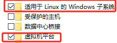
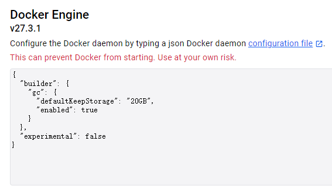
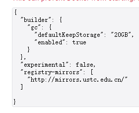
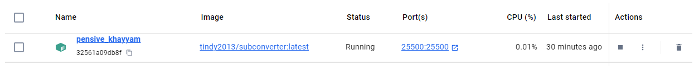
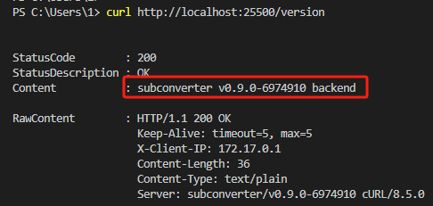

## Docker Desktop安装之前建议启用，不建议用Hype-v

## Docker Desktop安装教程不再赘述
**_需要梯子，不然可能获取不到镜像。也可以自行更改镜像，操作如下：_**

右上角打开Settings

选择Docker Engine，初始状态如下：

修改为：

保存重启

**国内镜像源关停跑路太多，建议自行搜索可用镜像源**

**也可参考该链接：**

- https://gist.github.com/y0ngb1n/7e8f16af3242c7815e7ca2f0833d3ea6

## 启动Docker Desktop后

    docker run -d --restart=always -p 25500:25500 tindy2013/subconverter:latest

此时输入
 - curl http://localhost:25500/version

说明服务已经正常运行，如果没有特殊的需求。~~不知道自己有没有就是没有~~

也可以查看docker容器内的pref.example.ini寻找自己的需求，路径：
- /base/pref.example.ini

通过修改链接http://localhost:25500 来使用

参考[该篇](一个链接同时实现配置模板和后端订阅转换.md)

