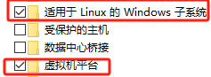
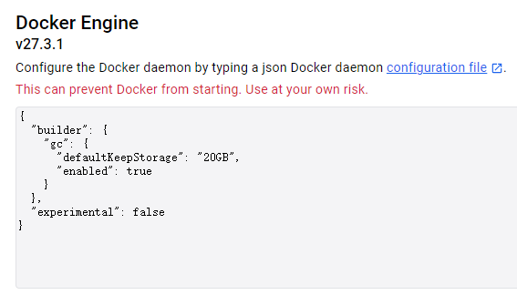
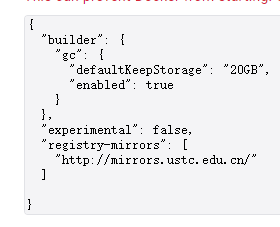
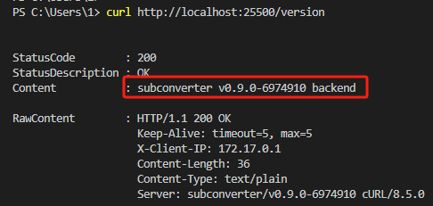
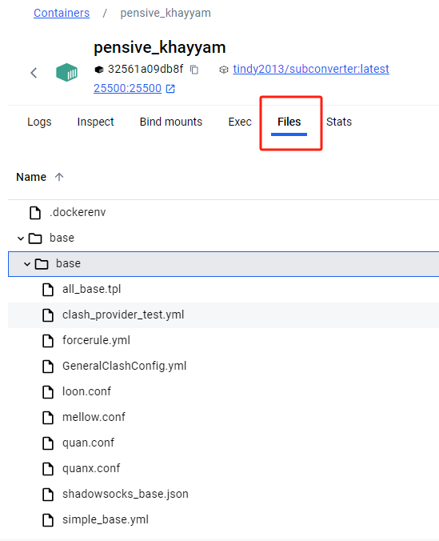
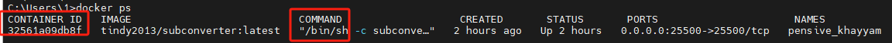
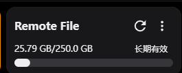
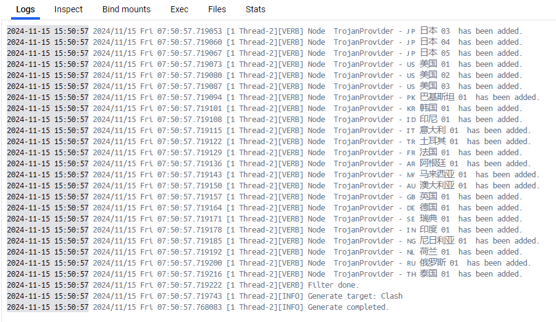
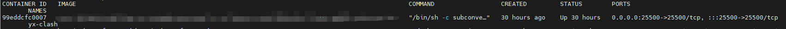
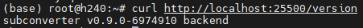

# 镜像原作者：https://github.com/tindy2013/subconverter

————————————**********————————————

# Docker Desktop安装之前建议启用，不建议用Hype-v

# Docker Desktop安装教程不再赘述
**_需要梯子，不然可能获取不到镜像。也可以自行更改镜像，操作如下：_**

右上角打开Settings

选择Docker Engine，初始状态如下：

修改为：

保存重启

**国内镜像源关停跑路太多，建议自行搜索可用镜像源**

**也可参考该链接：**

- https://gist.github.com/y0ngb1n/7e8f16af3242c7815e7ca2f0833d3ea6

# Docker Desktop

启动后，cmd输入：

    docker run -d --name (自己写) --restart=always -p 25500:25500 tindy2013/subconverter:latest

此时输入
 - curl http://localhost:25500/version

说明服务已经正常运行，如果没有特殊的需求。~~不知道自己有没有就是没有~~

也可以查看docker容器内的pref.example.ini寻找自己的需求

点击Name进入容器内部

路径：
- /base/pref.example.ini

通过链接 http://127.0.0.1:25500/sub?target= 来使用

参考[该篇](一个链接同时实现配置模板和后端订阅转换.md)

### 修改ini配置文件

通过cmd输入docker ps，查看正在运行中的容器id

**重点注意CONTAINER ID，一般需要前四位。COMMAND的路径为/bin/sh,进入容器时需要输入sh作为directory**

通过：

    - docker exec -it (你的容器id前四位) (COMMONbin路径)

            e.g：docker exec -it 3256 sh

进入后，配置文件都在base目录内

***也可以在[原作者](#镜像原作者httpsgithubcomtindy2013subconverter)github下载linux版本的安装包，在本地进行修改***

修改完成后通过命令复制进容器替换

    - docker cp (本地文件路径)(容器ID/容器NAME:容器内路径)

    e.g：docker cp C:\Users\1\Desktop\subconverter\. 3256:/base/

### **成功：**

# Docker Linux

## docker国内镜像源无法使用问题参考
## - https://github.com/yixuan-ovo/docker_image_pusher

## 拉取镜像并启动(没梯子不要用，用上面的教程)

-     docker pull tindy2013/subconverter

-     docker run -d --name (自己写) --restart=always -p 25500:25500 tindy2013/subconverter

此时容器已经启用，输入

    curl http://localhost:25500/version

说明成功部署，可以在自定义订阅链接转换处使用

http://（你的linux ip地址）:25500/sub

来转换订阅链接