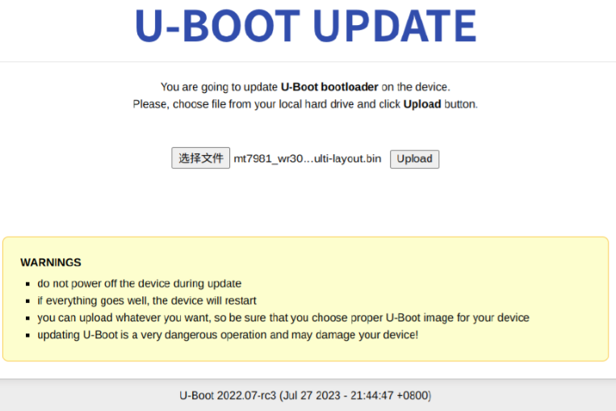

## Aron Wallpaper
luci-app-argon主题替换壁纸

## 官方镜像版本、系统配置文件备份

## 增加不死uboot更新

- https://github.com/hanwckf/bl-mt798x

- https://cmi.hanwckf.top/p/mt798x-uboot-usage/

如果要使用webui更新uboot，可以访问http://192.168.31.1/uboot.html,选择FIP格式的uboot二进制并上传刷入即可

